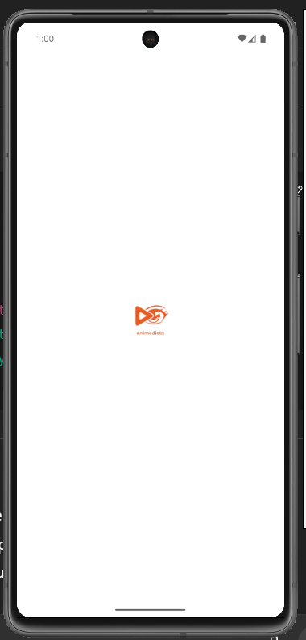
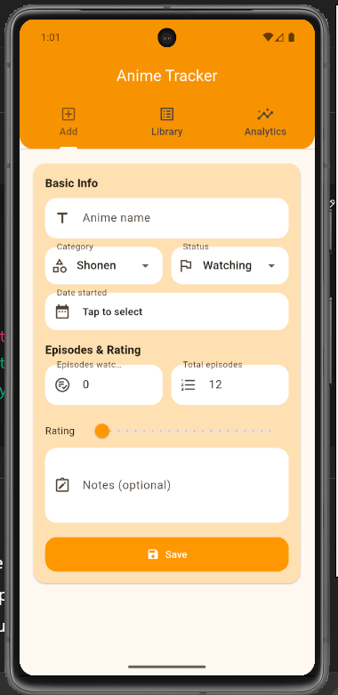
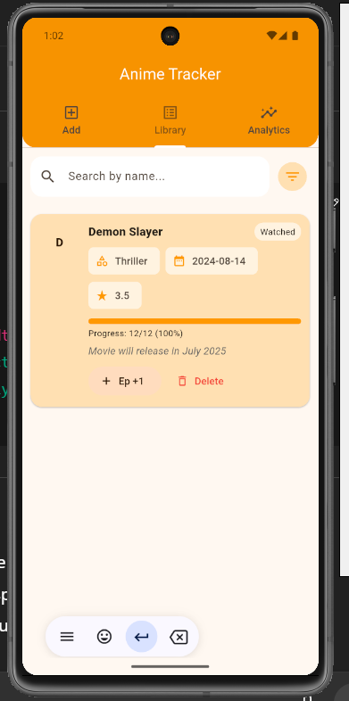
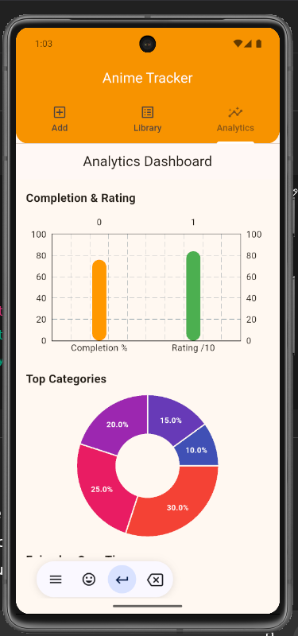

# 📖 My Anime Hub

A **Flutter-powered anime diary & dictionary** app that helps you:
- Track what you are watching
- Maintain a dictionary of anime offline (SQLite-powered)
- View progress and stats with charts & logs
- Generate personalized insights about your anime journey

---
## 🖼 Screenshots

<div align="center">
  
  
  
  
</div>

---

## ✨ Features
- 📚 **Anime Dictionary** – Offline-first using SQLite database
- 📝 **Diary System** – Log watched and planned anime
- 📊 **Analytics Dashboard** – Charts & stats for tracking habits
- 🔄 **Local + Refresh Support** – Works offline with option to refresh
- 🎨 **Custom App Icon & Branding**
- 📱 **Optimized for Android (minSdk 27)**

---

## 📂 Project Structure
lib/
┣ main.dart # Entry point
┣ pages/ # Screens & UI
┣ database/ # SQLite setup & queries
┣ widgets/ # Custom UI widgets
assets/
┗ images/logo.png # App logo

yaml
Copy
Edit

---

## 🚀 Getting Started

### Prerequisites
- [Flutter SDK](https://docs.flutter.dev/get-started/install) (>=3.0)
- Android Studio / VS Code with Flutter extensions
- Android NDK 27.0.12077973 (for sqflite & path_provider)

### Installation
```bash
# Clone repo
git clone https://github.com/YOUR_USERNAME/anime-dictionary.git
cd anime-dictionary

# Install dependencies
flutter pub get

# Run on emulator/device
flutter run
📦 Build APK
bash
Copy
Edit
flutter clean
flutter pub get
flutter pub run flutter_launcher_icons
flutter build apk --release
Find the generated APK here:

swift
Copy
Edit
build/app/outputs/flutter-apk/app-release.apk
🖼 Screenshots
Home	Dictionary	Analytics

(Replace the screenshots in docs/screenshots/ with your own app screenshots)

⚡ Tech Stack
Flutter 3.x

SQLite (sqflite package)

Path Provider

Charts (fl_chart or recharts)

Flutter Launcher Icons

🛠 Contribution
Fork the repo

Create a feature branch (git checkout -b feature/your-feature)

Commit your changes (git commit -m "Added new feature")

Push to branch (git push origin feature/your-feature)

Open a Pull Request
